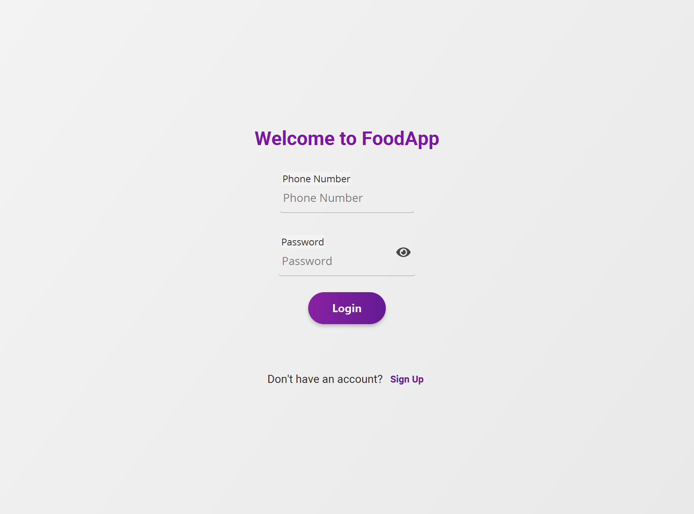
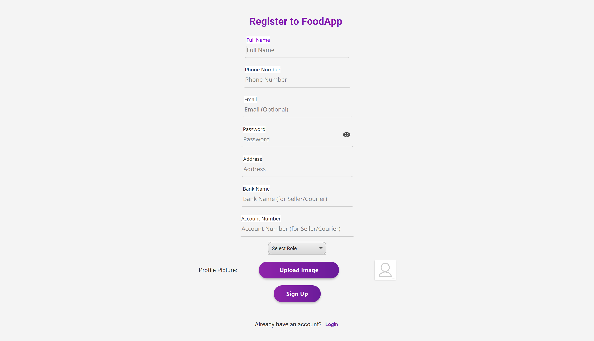
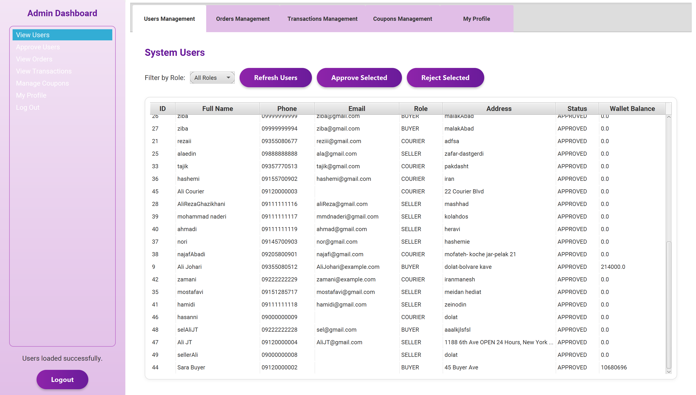
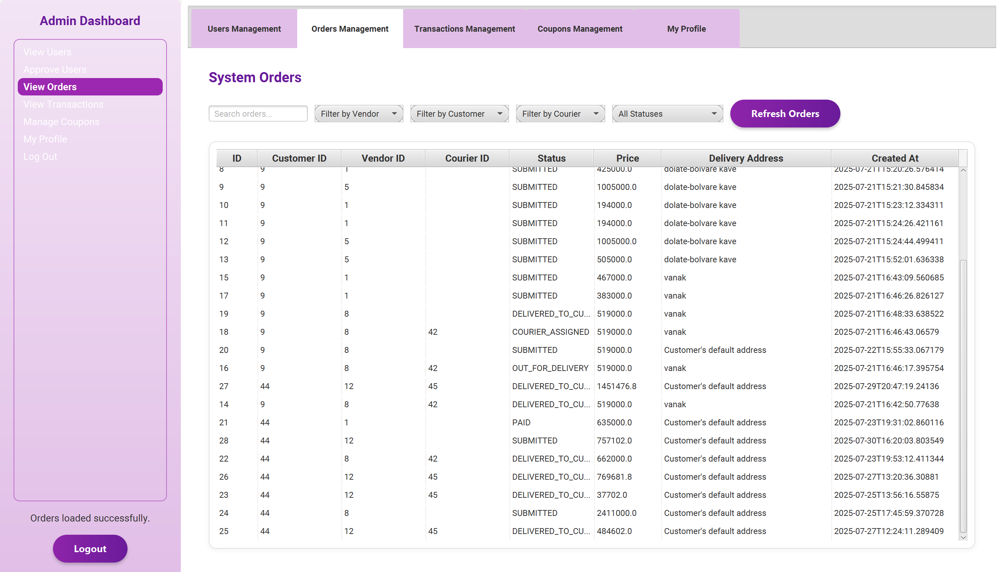
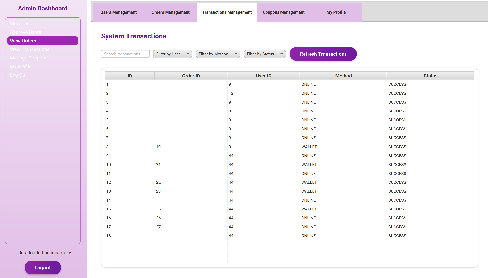
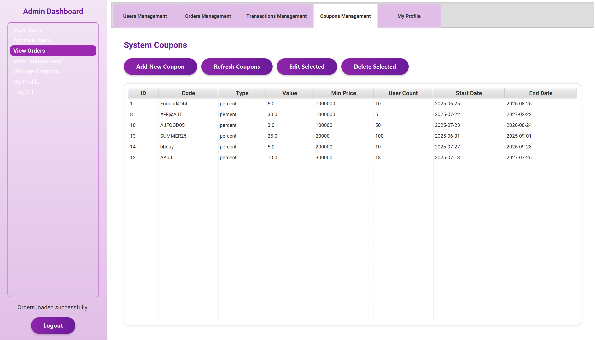
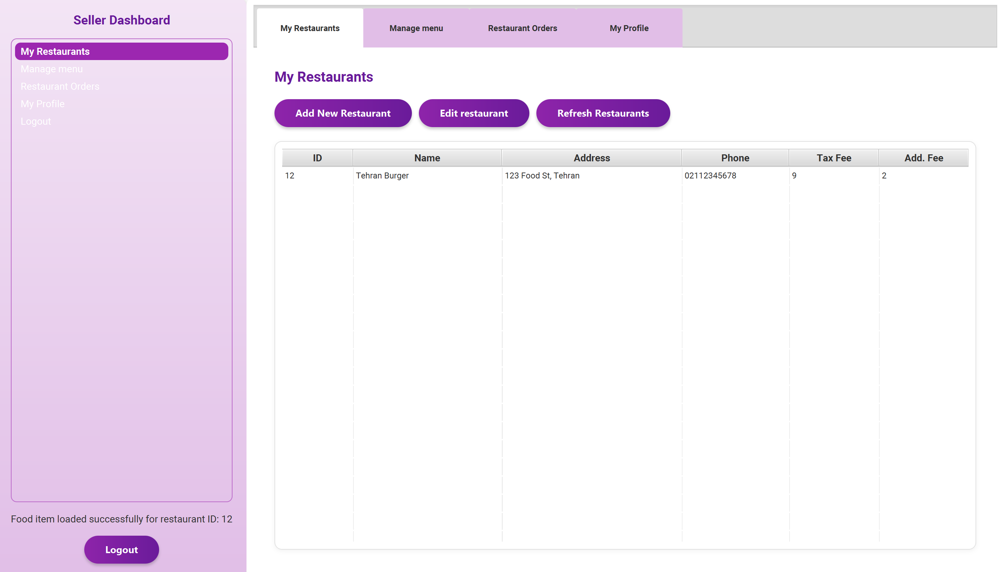
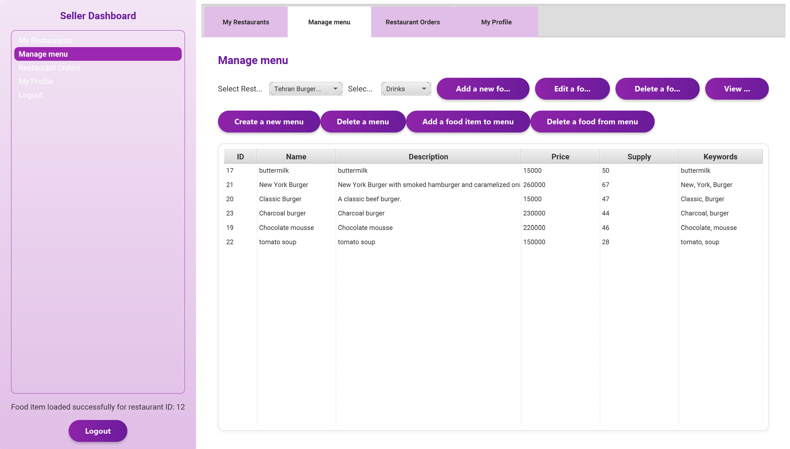
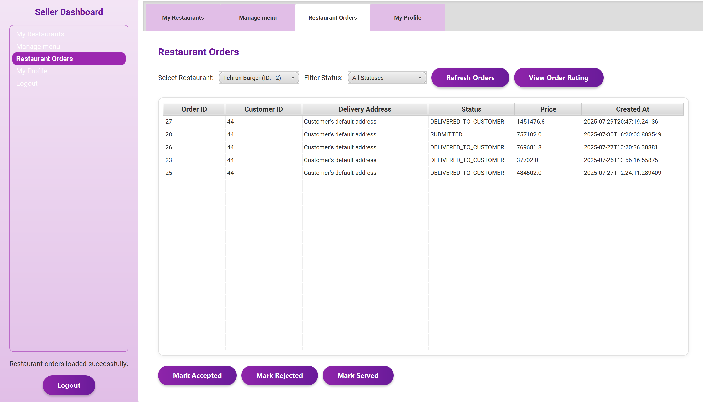
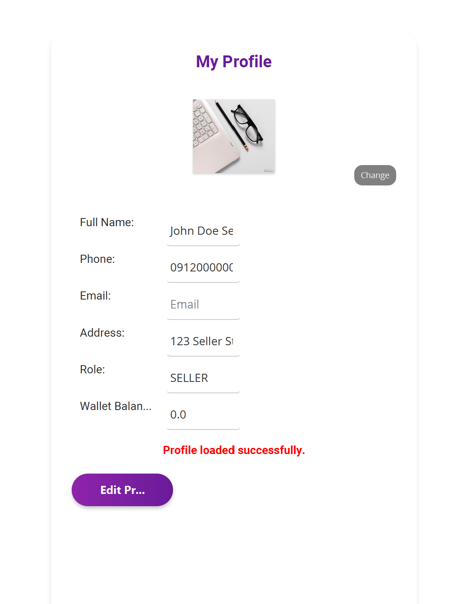

# 🎨 AUT-Food Frontend (JavaFX)

## 📌 Introduction

This is the **JavaFX-based frontend** of the AUT-Food system, developed as part of the **Advanced Programming Course – Spring 1404** at **Amirkabir University of Technology**.

The application provides a complete graphical interface for a food ordering system that supports multiple user roles:

- 🛒 Customers
- 🏪 Sellers (Restaurant Owners)
- 🚚 Couriers
- 🔧 Admins

It communicates with the backend through a RESTful API based on the `aut_food.yaml` specification and implements all features described in the official project documentation.

---

## 🧩 Features

### 🔐 User Authentication & Management
- Role-based login and registration
- Profile editing (address, phone, banking info)
- Dashboard for each user type

### 🛍️ Customer Features
- Browse restaurants and categorized menus
- Search and filter by name, rating, or price
- Add food to cart and place orders
- View order history and track live status
- Submit comments and rate meals

### 🏪 Seller Features
- Register and manage restaurants
- Create and manage menus
- Track incoming orders and update statuses
- Apply discounts and view revenue dashboard

### 🚚 Courier Features
- View assigned orders
- Update delivery status
- View delivery history

### ⚙️ Admin Features
- Approve users and restaurant registrations
- View system-wide orders and statistics
- Moderate content and manage finances

### 💳 Payment & Wallet
- Pay orders online or with internal wallet
- View invoice with tax and delivery fee
- Track payment history

### 📲 Notifications
- Real-time status updates
- Visual feedback on actions (e.g., order confirmation)

---

## 🚀 Getting Started

### 🛠️ Requirements

- Java 17+
- Maven
- JavaFX SDK (may be bundled in your IDE)
- Running backend server (see backend README)

📦 All dependencies are defined in `pom.xml`.  
Modules are configured in `module-info.java`.

---

### ▶️ Run the Application

```bash
cd "ap project frontend/ApProject_foddApp_frontend"
mvn clean javafx:run
```

> Make sure the backend is running and accessible from the frontend (configured in `ApiClient.java`).

---

## 🗂️ Project Structure

```
ApProject_foddApp_frontend/
├── pom.xml
├── src/
│   ├── main/java/com/foodapp/food4ufrontend/
│   │   ├── controller/
│   │   ├── model/
│   │   ├── util/
│   │   └── Food4uApp.java
│   └── main/resources/com/foodapp/food4ufrontend/view/
│       ├── *.fxml (UI layout files)
```

---

## 📚 API Integration

- The frontend uses `HttpURLConnection` to interact with the backend
- All endpoints conform to the OpenAPI standard defined in `aut_food.yaml`
- JSON parsing is handled via internal utility classes

---

## 🧪 Testing

- Full GUI testing via user interaction
- Works seamlessly with the backend project
- Handles user input validation and API error responses

---

## 👨‍🏫 Supervision

This project was developed for the **Advanced Programming Course – Spring 1404**  
**Amirkabir University of Technology**

Supervised by:
- Dr. Amir Kalbasi  
- Dr. Hossein Zeynali

---

## 📣 Notes

- Follows MVC pattern using JavaFX and FXML
- Compatible with any RESTful backend based on the provided API
- Designed to be modular, scalable, and user-friendly

## 📸 Preview






## 🔧 Admin Dashboard













## 🏪 Seller Dashboard













## 🛒 Customer Dashboard


## 🚚 Courier Dashboard

